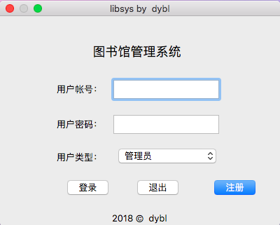
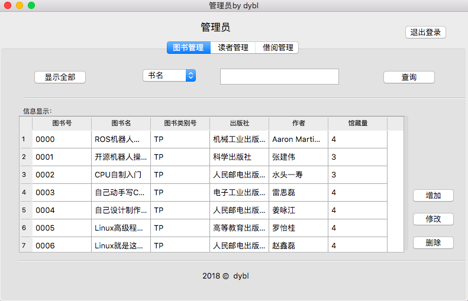
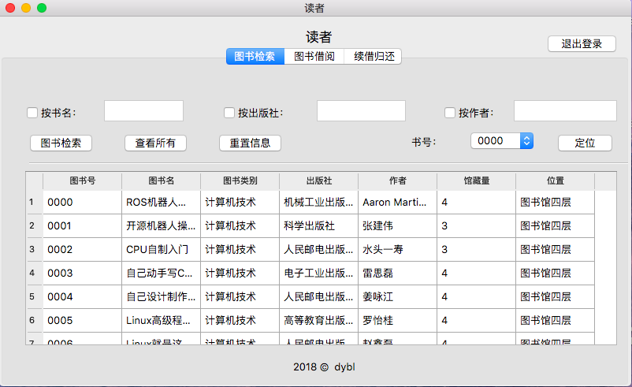
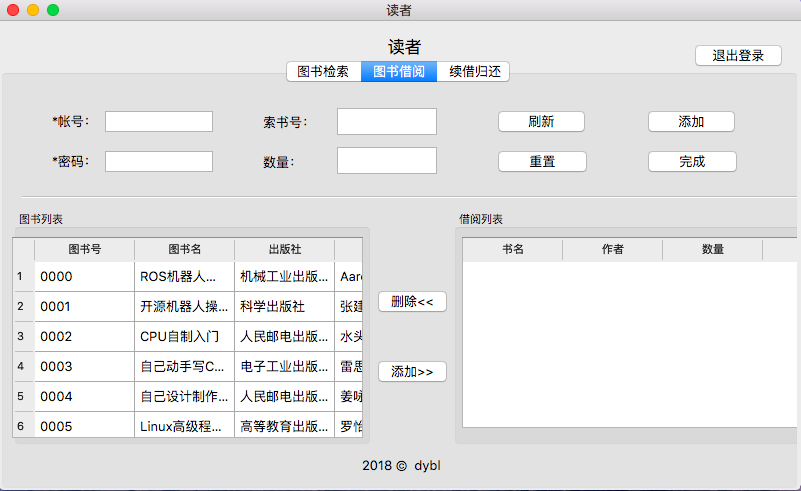

# 图书管理系统 BookManageSystem


## Qt GUI 图形界面版本






`lms => Library Managememt System`
(即`图书馆管理系统`)

### 简介:
lms是一个简单的图书馆管理系统，界面是基于qt开发的，用mysql存储数据，基本实现了用户登录注册，增删改查图书及用户等功能，

### 开发环境:
- windows： 1803 64bit
- macosx 10.13.3 64bit
- Qt: 5.11.2
- MySQL: 5.7.24


### For MacOSX

> 在release里下载`lms.dmg`,自行选择合适的安装位置，本程序大概占用60mb的磁盘空间.

### 使用前配置:

- 确保你本机上已经安装了MySQL，并且版本号5.5.x以后，截至目前最新的是5.7.24，当然你用5.0.x也许也能够运行，不过我没有测试过。

**注意，不要使用版本号为8.x.x的，版本号前缀不是5系列的不兼容本程序**

- 没有安装的可以在mysql官网上免费下载最新的5.7.24-windows-社区版，32位或者64位的都行.如有疑惑，请自行百度

### 数据库脚本导入:

- 已经为mysql配置过环境变量的直接打开cmd或者powershell，输入以下命令即可

``` bash
mysql -uroot -p 
create database libsys;
use libsys;
source <libsys安装目录>\doc\libsys.sql
```
**导入过程出现问题，请根据报错自行排查**

## SHELl CLI 命令行版本

|图书 | 管理员 | 读者|
| -- | -- | -- |
书名 | 姓名 | 姓名
作者 | 性别 | 性别
出版社 | 出生年月 | 出生年月
出版日期 | 学院 | 学院
价格 | 密码 | 密码
ISBN | 工号 | 学号
类别 | 读者类型	| xxx
是否在架 | 账号余额 | xxx
借阅次数 | 借书数 | xxx
xxx	| 超期图书数 | xxx

## 需求概述 Requirement Overview

- 在图书管理系统中
  - 管理员为每个读者建立一个账户
    - 账户内存储读者个人的详细信息
      - 并依据读者类别的不同给每个读者发放借书卡(提供借书卡号、姓名、部门或班级等信息)
    - 读者可以凭借书卡在图书馆进行图书的
      - 借
      - 还
      - 续借
      - 查询等操作
    - 不同类别的读者在
      - 借书限额
      - 还书期限
      - 可续借的次数上要有所不同.
- 借阅图书时
  - 由管理员录入借书卡号
  - 系统首先验证该卡号的有效性
    - 若无效
      - 则提示无效的原因
      - 若有效
        - 则显示
          - 卡号
          - 姓名
          - 借书限额
          - 已借数量
          - 可再借数量等
  - 本次实际借书的数量不能超出可再借数量的值.
  - 完成借书操作的同时要
    - 修改相应图书信息的状态、读者信息中的已借数量、在借阅信息中添加相应的记录.
- 归还图书时
  - 由管理员录入借书卡号和待归还的图书编号
    - 显示借书卡号
    - 读者姓名
    - 读书编号
    - 读书名称
    - 借书日期
    - 应还日期等信息，
    - 并自动计算是否超期以及超期的罚款金额
      - 若进行续借则取消超期和罚款等信息
        - 若图书有损坏，由管理员根据实际情况从系统中选择相应的损坏等级，系统自动计算损坏赔偿金额.
- 完成归还操作的同时
  - 修改相应图书信息的状态
  - 修改读者信息中的已借数量
  - 在借书信息中对相应的借书记录做标记
  - 在还书信息中添加相应的记录.
- 图书管理员不定期地
  - 对图书信息进行
    - 添加
    - 修改
    - 删除等操作
    - 在图书尚未归还的情况下不能对图书信息进行删除.
  - 也可以对读者信息进行
    - 添加
    - 修改
    - 删除等操作
    - 在读者还有未归还的图书的情况下不能进行删除读者信息.
- 系统管理员主要进行
  - 图书管理员权限的设置
  - 读者类别信息的设置
  - 图书类别的设置以及罚款和赔偿标准的设置、数据备份和数据恢复等处理.

## 如何构建? How to build?

- Linux

```bash
git clone https://github.com/dybl/douB.git
cd src/bms/
gcc -Wall bms.c -o bms
./bms
```

- Windows

  - if you use Mingw, thus you can do the same as linux;
  - if you use vs2017, just click the mouse;

- MacOsX

  - Firstly, modify the **bms.h** 

  ```c
  #include<malloc.h>
  #include<time.h>
  ```

  to->

  ```c
  #include<sys/malloc.h>
  #include<sys/time.h>
  ```

  - thus you can 

  ```bash
  clang bms.c -o bms
  ./bms
  ```

## Enjoy it!


```shell
└─[$] <git:(dev*)> ./bms
==============================================================|
|                           图书管理系统                        |
+-------------------------------------------------------------+
| <1>                  系统管理员请按1                          
| <2>                  图书管理员按2                            
| <3>                  读者游客请按3                            
| <4>                  查看最受欢迎的书请按4                     
| <5>                  退出请按0                                
| <6>                  请输入0--4,其他指令不可用!                
+-------------------------------------------------------------+
```


## License

```sh
Copyright 2019 dybl

Licensed under the Apache License, Version 2.0 (the "License");
you may not use this file except in compliance with the License.
You may obtain a copy of the License at

    http://www.apache.org/licenses/LICENSE-2.0

Unless required by applicable law or agreed to in writing, software
distributed under the License is distributed on an "AS IS" BASIS,
WITHOUT WARRANTIES OR CONDITIONS OF ANY KIND, either express or implied.
See the License for the specific language governing permissions and
limitations under the License.
```
